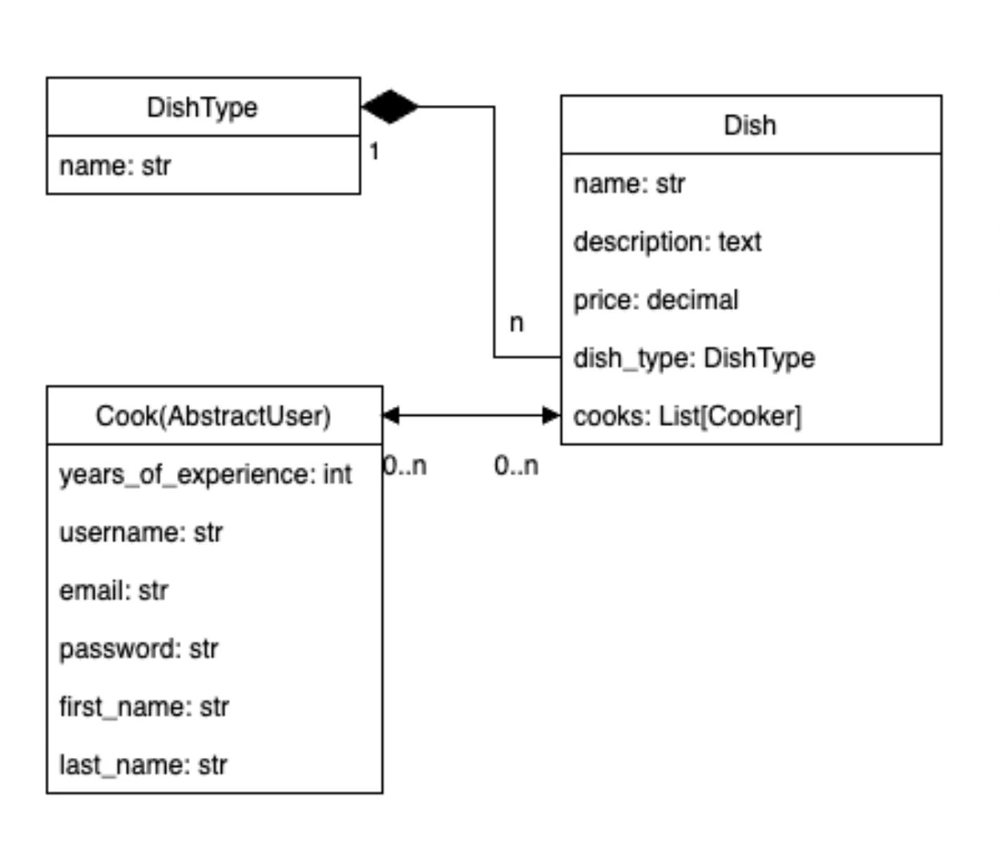
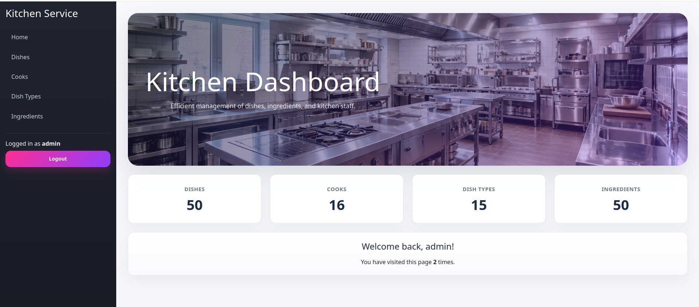

# Restaurant Kitchen Service

A Django-based web application for managing dishes, ingredients, dish types, and cooks in a restaurant kitchen.

## Live Demo

Live Demo: [Restaurant Kitchen Service](https://restaurant-kitchen-service-279w.onrender.com)

Use these credentials to log in and explore the demo:
- Username: `user`
- Password: `user12345`

## Database Structure

The database includes four main entities:

- **DishType** — category of a dish.
- **Dish** — main model describing dishes with name, description, price, type, ingredients, and assigned cooks.
- **Cook** — custom user model based on `AbstractUser`, extended with `years_of_experience`.
- **Ingredient** — ingredient used in dishes.

## DB Schema



## Demo



## Features

- Authentication system based on Django auth
- Custom user model: `Cook`
- Create, read, update, and delete functionality for:
  - cooks
  - dishes
  - dish types
  - ingredients
- Assign cooks to dishes
- Add ingredients to dishes
- Search functionality on list pages
- Pagination for convenient browsing through large amounts of data
- Admin panel for database management
- Fixture support with demo data via `kitchen_data.json`
- Styled homepage dashboard with project statistics

## Technologies Used

- **Backend:** Python, Django, Django ORM
- **Frontend:** HTML5, CSS3, Django Templates, Bootstrap 5
- **Database:** SQLite3

## Getting Started

These instructions will help you set up the project locally.

### 1. Clone the repository

```bash
git clone https://github.com/Livan94/-restaurant-kitchen-service.git
cd -restaurant-kitchen-service
```

### 2. Create and activate virtual environment

#### Linux / macOS

```bash
python -m venv .venv
source .venv/bin/activate
```

#### Windows

```bash
python -m venv .venv
.venv\\Scripts\\activate
```

### 3. Install dependencies

```bash
pip install -r requirements.txt
```

### 4. Apply migrations

```bash
python manage.py migrate
```

### 5. Collect static files

```bash
python manage.py collectstatic
```

### 6. Create a superuser

```bash
python manage.py createsuperuser
```

### 7. Load demo data

```bash
python manage.py loaddata kitchen_data.json
```

> **Important:**  
> The fixture file does not provide a ready-to-use admin password.  
> Create your own admin account locally with `createsuperuser`.

### 8. Run the server

```bash
python manage.py runserver
```

Open in browser:

```text
http://127.0.0.1:8000/
```

## Demo Data

The project includes a `kitchen_data.json` fixture file with enough sample records to demonstrate:

- pagination
- search
- list views
- many-to-many relationships
- dashboard statistics

The fixture contains sample:
- dish types
- ingredients
- cooks
- dishes

## Usage

After launching the project, you can:

- log in with your superuser account
- browse dishes, cooks, ingredients, and dish types
- search records on list pages
- view paginated results
- manage records through the web interface
- use the Django admin panel for advanced data management

## Author

Developed as a study project for practicing Django, database modeling, authentication, class-based views, and frontend integration.